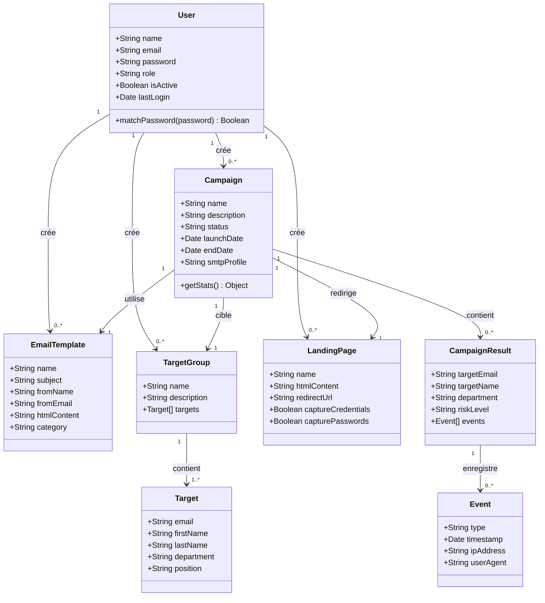
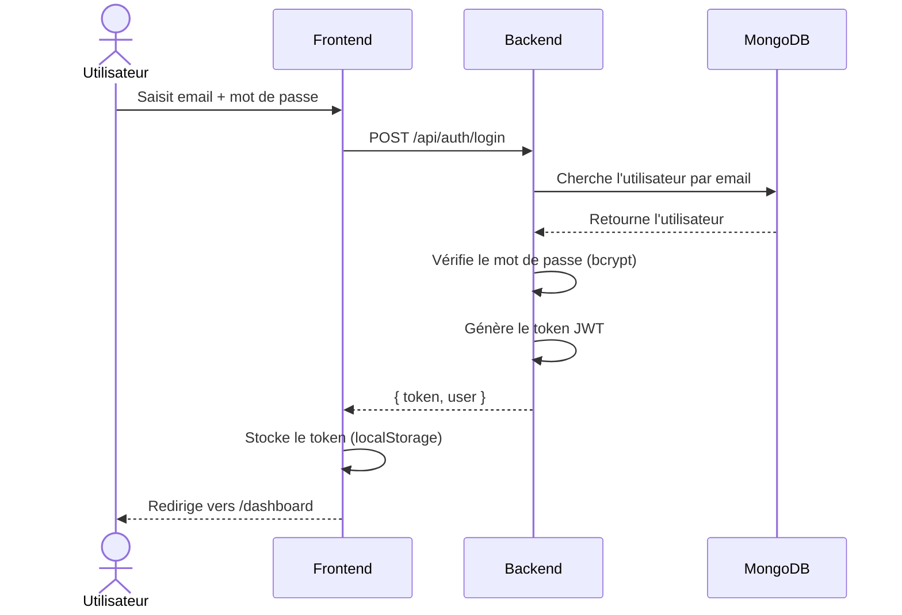
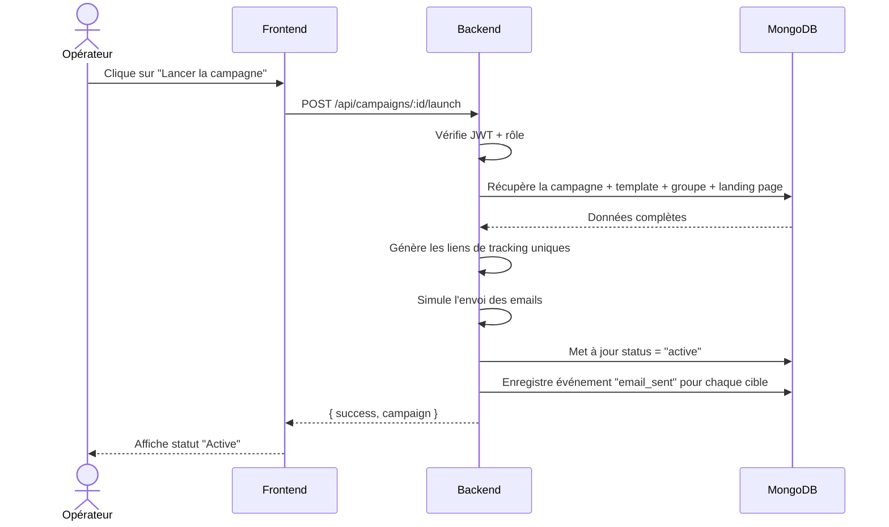
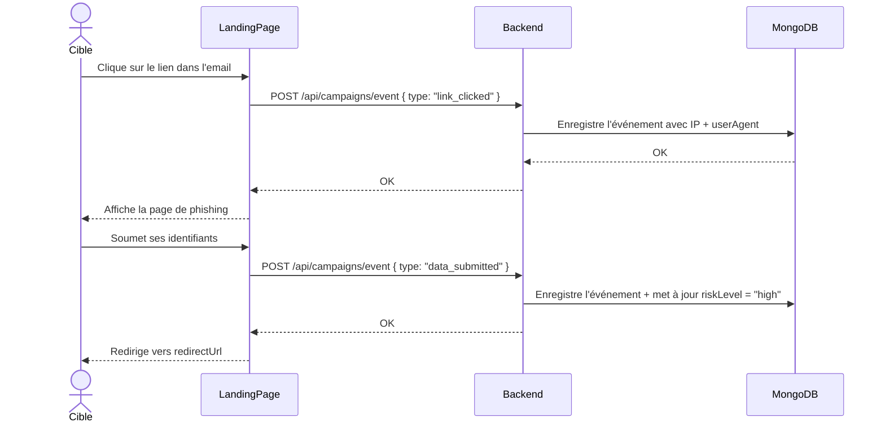
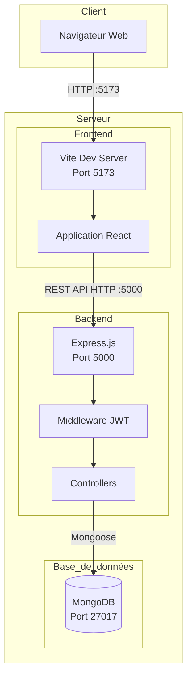
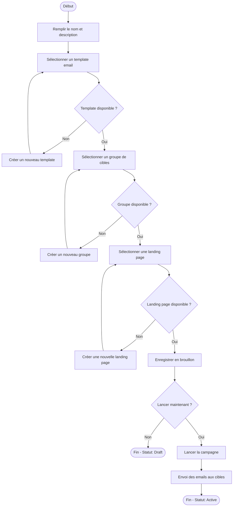

# Conception - PhishGuard

---

## 1. Diagramme de Cas d'Utilisation

```mermaid
graph TD
    Admin((Administrateur))
    Operator((Opérateur))
    Viewer((Observateur))
    Cible((Cible / Employé))

    Admin --> UC1[Se connecter]
    Admin --> UC2[Gérer les utilisateurs]
    Admin --> UC3[Créer une campagne]
    Admin --> UC4[Lancer / Pauser une campagne]
    Admin --> UC5[Gérer les templates email]
    Admin --> UC6[Gérer les groupes de cibles]
    Admin --> UC7[Gérer les landing pages]
    Admin --> UC8[Consulter les résultats]
    Admin --> UC9[Voir le dashboard]

    Operator --> UC1
    Operator --> UC3
    Operator --> UC4
    Operator --> UC5
    Operator --> UC6
    Operator --> UC7
    Operator --> UC8
    Operator --> UC9

    Viewer --> UC1
    Viewer --> UC8
    Viewer --> UC9

    Cible --> UC10[Recevoir un email de phishing]
    Cible --> UC11[Cliquer sur le lien]
    Cible --> UC12[Soumettre ses données]
    Cible --> UC13[Signaler l'email]
```

---

## 2. Diagramme de Classes

---

## 3. Diagramme de Séquence - Authentification

---

## 4. Diagramme de Séquence - Lancement d'une Campagne

---

## 5. Diagramme de Séquence - Tracking d'un Événement

---

## 6. Diagramme de Déploiement

---

## 7. Diagramme d'Activité - Création d'une Campagne

---

## 8. Matrice des Droits (RBAC)

| Fonctionnalité | Admin | Opérateur | Observateur |
|----------------|-------|-----------|-------------|
| Voir dashboard | ✅ | ✅ | ✅ |
| Voir campagnes | ✅ | ✅ | ✅ |
| Créer campagne | ✅ | ✅ | ❌ |
| Lancer/Pauser campagne | ✅ | ✅ | ❌ |
| Supprimer campagne | ✅ | ❌ | ❌ |
| Gérer templates | ✅ | ✅ | ❌ |
| Gérer groupes | ✅ | ✅ | ❌ |
| Gérer landing pages | ✅ | ✅ | ❌ |
| Gérer utilisateurs | ✅ | ❌ | ❌ |
| Voir résultats | ✅ | ✅ | ✅ |
